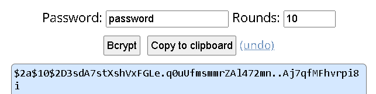
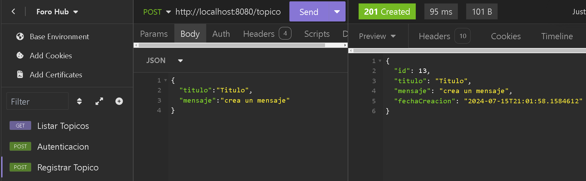
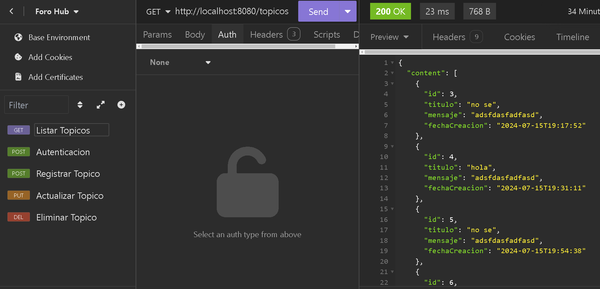
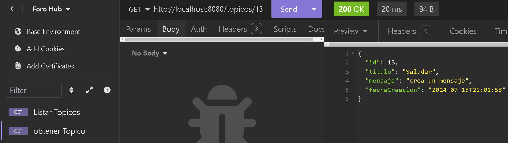
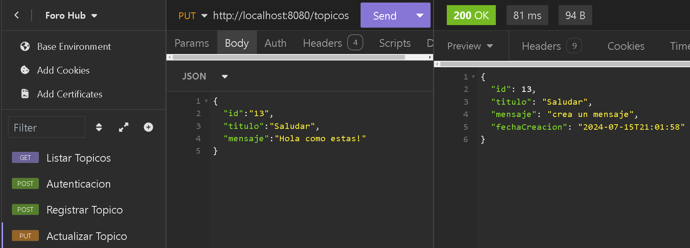
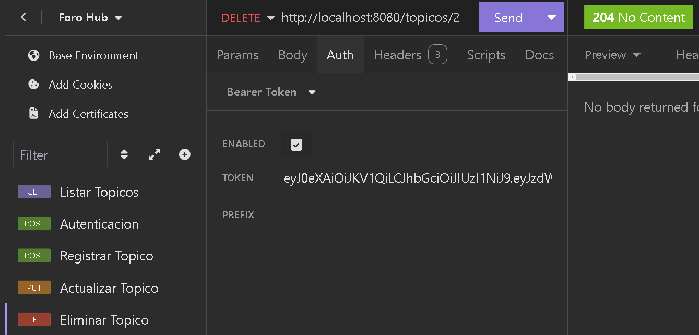

# ForoHub - Alura Challenge

ForoHub es una aplicación web desarrollada en Java utilizando Spring Boot, creada para gestionar tópicos en un foro. Esta solución fue diseñada como respuesta al cuarto desafío de programación de Oracle Next Generation (ONE) de Alura. ForoHub permite a los usuarios autenticados realizar operaciones como crear, listar, actualizar y eliminar tópicos. La aplicación utiliza MySQL como sistema de gestión de bases de datos y sigue las mejores prácticas para el desarrollo de APIs REST.

## Características

- **Gestión de tópicos:** Crea, lee, actualiza y elimina tópicos en el foro.
- **Autenticación de usuarios:** Solo usuarios autenticados pueden interactuar con la API.
- **Persistencia de datos:** Utiliza PostgreSQL para almacenar datos.
- **Migraciones de base de datos:** Flyway para gestionar cambios en el esquema de la base de datos.
- **Validación de datos:** Asegura la calidad de los datos mediante validaciones.

## Tecnologías

- **Java:** Versión 21.
- **Maven:** Gestión de dependencias y construcción del proyecto.
- **Spring Boot:** Framework para desarrollar la aplicación. Versión 3.
- **PostgreSQL:** Sistema de gestión de bases de datos. Versión 16.
- **Flyway:** Migraciones de base de datos
- **Spring Security:** Seguridad y autenticación de usuarios

## Estructura del Proyecto

El proyecto está organizado en los siguientes paquetes principales:

- **config**: Configuraciones de Spring Boot, incluyendo la configuración de seguridad.
- **controller**: Controladores REST que gestionan las solicitudes de la API.
- **Domain**: Clases de modelo que representan las entidades de la base de datos.
- **repository**: Repositorios para acceder a los datos en la base de datos.
- **service**: Lógica de negocio de la aplicación.
- **dto**: Clases de transferencia de datos (DTO) para las solicitudes y respuestas de la API.

>[!IMPORTANT]
> ## Migraciones con Flyway

Para gestionar las migraciones de base de datos, Flyway se encarga de aplicar los scripts SQL en orden. Asegúrate de mantener el orden de las migraciones y crear los archivos en el directorio `src/main/resources/db/migration`.

> Si decides cambiar a MySQL, asegúrate de ajustar los scripts SQL para ser compatibles con MySQL y cambiar la URL de conexión en `application.properties`.

## Autenticación

- La API utiliza autenticación básica para proteger los endpoints. Asegúrate de enviar un encabezado `Authorization` con las credenciales en formato `Basic` para acceder a los recursos de la API.

## Autorización

- La API utiliza utiliza un variable de entorno para validar la firma de la autorizacion que se puede cambiar en `src/main/resources/application.properties`
```
api.security.secret=${JWT_SECRET:123456}
```

## Instalación

1. **Clonar el Repositorio:**

   ```bash
   git clone https://github.com/tu_usuario/forohub.git
   ```

2. **Configurar MySQL:**

   Crea una base de datos en Posgrest y actualiza el archivo `src/main/resources/application.properties` con los detalles de tu base de datos y reemplaza `tu_usuario` y `tu_contraseña` con tus credenciales de Posgrest.

   ```properties
   spring.datasource.url=jdbc:mysql://localhost/foro_hub
   spring.datasource.username=tu_usuario
   spring.datasource.password=tu_contraseña
   ```

[//]: # (3. **Ejecutar Migraciones:**)

[//]: # ()
[//]: # (   Asegúrate de que las migraciones están aplicadas. Puedes ejecutar las migraciones con:)

[//]: # ()
[//]: # (   ```bash)

[//]: # (   mvn flyway:migrate)

[//]: # (   ```)

[//]: # ()
[//]: # (4. **Ejecutar la Aplicación:**)

[//]: # ()
[//]: # (   Inicia la aplicación con el siguiente comando:)

[//]: # ()
[//]: # (   ```bash)

[//]: # (   mvn spring-boot:run)

[//]: # (   ```)

## Uso

Una vez que la aplicación esté en ejecución, puedes interactuar con la API a través de los siguientes endpoints:

- **<a href="#gestion">POST</a>** `/api/topics`: Crear un nuevo tópico.
- **<a href="#listar">GET</a>** `/api/topics`: Listar todos los tópicos.
- **<a href="#detalle">GET</a>** `/api/topics/{id}`: Obtener los detalles de un tópico por ID.
- **<a href="#actualizar">PUT</a>** `/api/topics/{id}`: Actualizar un tópico existente.
- **<a href="#eliminar">DELETE</a>** `/api/topics/{id}`: Eliminar un tópico por ID.

### Crear usuario
- Al ejecutar el proyecto se creará un usuario default en la tabla usuarios:
```json
{
	"login":"usuario",
	"clave":"password"
}
```
- Puedes generar la clave encriptada en [Bcrypt Password Generator](https://www.browserling.com/tools/bcrypt)

- Crear usuario creando un archivo nuevo en db.migration "V6__alter-table-usuarios-insert-login-clave.sql"
```sql
INSERT INTO `base_datos`.`usuarios` (`login`, `clave`) 
VALUES ('usuario', 'clave encriptada');
```
## Comandos para Probar la API

Puedes probar los endpoints de la API usando herramientas como [insomnia](https://insomnia.rest/) o [Postman](https://www.postman.com/).

### Ejemplos de Endpoints

- **<p id="gestion">Registrar un Tópico:</p>**
    - **POST** `/topicos`
    - **Body**
    - **Nesecita token**

        ```json
        {
            "titulo": "Título del Tópico",
            "mensaje": "Mensaje del Tópico",
            "autor": "Autor del Tópico"
        }
        ```
        <p></p>
        

- **<p id="listar">Listar Tópicos:</p>**
    - **GET** `/topicos`
    - **No nesecita token**

        <p></p>

- **<p id="detalle">Detalle de un Tópico:</p>**
    - **GET** `/topicos/{id}`
    - **No nesecita token**

<p></p>

- **<p id="actualizar">Actualizar un Tópico:</p>**
    - **PUT** `/topicos/{id}`
    - **Body**:
    - **Nesecita token**
        ```json
        {
            "id": "<id>",
            "titulo": "Nuevo Título del Tópico",
            "mensaje": "Nuevo Mensaje del Tópico"
        }
        ```
<p></p>

- **<p id="eliminar">Eliminar un Tópico:</p>**
- **DELETE** `/topicos/{id}`
- **Nesecita token**
<p></p>